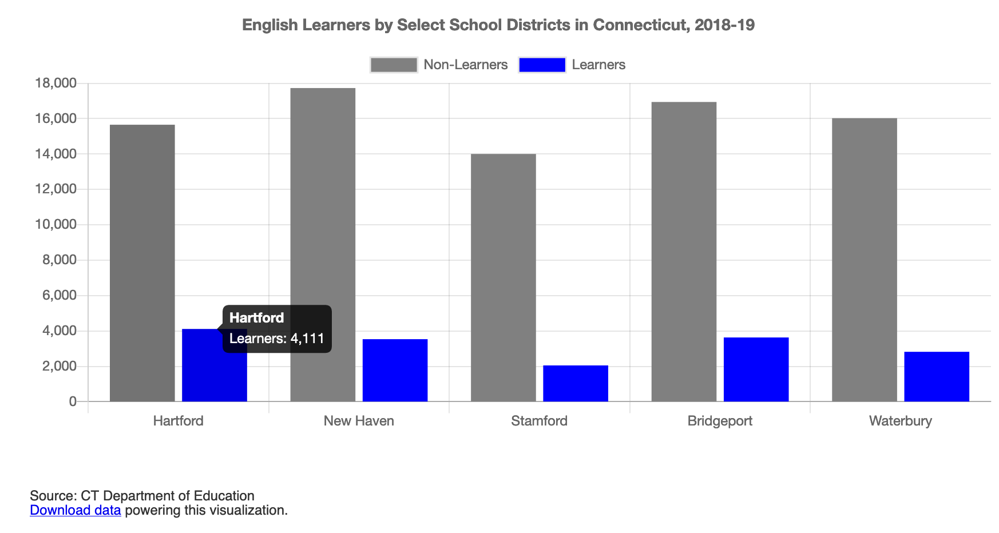

# Bar or Column Chart with 1+ Data Series



See step-by-step Chart.js tutorials in Chapter 10 of [Hands-On Data Visualization book](https://handsondataviz.org/chartcode.html)

Prepare your data in CSV format and upload into a `data.csv` file. Place labels that will appear along the axis in the first column, and each data series in its own column. Your CSV must contain at least two columns (labels and one data series). You can add as many data series columns as you wish. 

| district  | nonlearner | learner |
|-----------|------------|---------|
| Hartford  | 15656      | 4111    |
| New Haven | 17730      | 3534    |

In `script.js`, customize the values of variables shown in the code snippet below:

```javascript
  var HORIZONTAL = false;   // `false` for vertical column chart, `true` for horizontal bar chart
  var STACKED = false;  // `false` for individual bars, `true` for stacked bars

  var TITLE = 'English Learners by Select School Districts in Connecticut, 2018-19';

  var LABELS = 'district';  // Column to define 'bucket' names on x-axis (for vertical column chart) or y-axis (for horizontal bar chart)

  var SERIES = [  // For each column representing a data series, define its name and color
    {
      column: 'nonlearner',
      name: 'Non-Learners',
      color: 'grey'
    },
    {
      column: 'learner',
      name: 'Learners',
      color: 'blue'
    }
  ];

  var X_AXIS = 'School Districts';  // x-axis label and label in tooltip
  var Y_AXIS = 'Number of Enrolled Students'; // y-axis label and label in tooltip

  var SHOW_GRID = true; // `true` to show the grid, `false` to hide
  var SHOW_LEGEND = true; // `true` to show the legend, `false` to hide
```

For more customization, see [Chart.js documentation](https://www.chartjs.org/docs/latest/).
